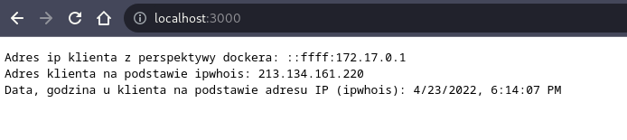
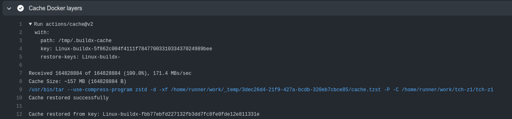
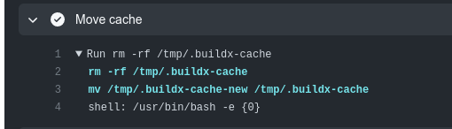
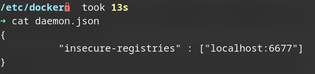
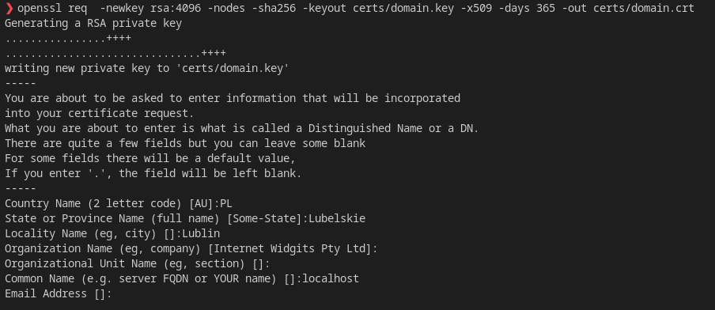
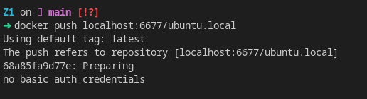
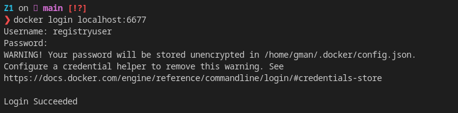
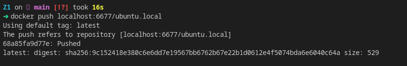

<h1>Technologie Chmurowe - zadanie1</h1>
<h2>CZĘŚĆ PODSTAWOWA</h2>
<h3>Autor: Konrad Miziński</h3>

Kod źródłowy aplikacji jest w katalogu "src", wraz z komentarzami.
Serwer domyślnie nasłuchuje na porcie 3000.

Plik Dockerfile wykorzystuje wieloetapowe budowanie obrazów.
W etapie 1 "STAGE1" zostaje wykorzystany obraz bazowy "node:alpine"
do pobrania niezbędnych pakietów w aplikacji.

Drugi etap to przygotowanie już głównego obrazu opartego na obrazie "alpine",
do którego po pobraniu pakietu "node" zostaje przeniesiona aplikacja z etapu 1.

Użyte polecenia wraz z opisem:
(Przed budowaniem obrazu na hoście został zainstalowany pakiet qemu-user-static, OS: ArchLinux)

<ul>
<li>Zbudowanie obrazu</li>
<ol>
<li><b>docker buildx create --name z1builder</b> - utworzenie nowego buildera</li>
<li><b>docker buildx use z1builder</b> - mówi builx'owi, którego buildera używać</li>
<li><b>docker buildx inspect --bootstrap</b> flaga --bootstrap powoduje, że buildx upewni się że builder wystartował, jeżeli nie to go uruchomi</li>
<li><b>docker buildx build -f Dockerfile -t gmanos/zadanie1:z1img --platform linux/arm/v7,linux/arm64/v8,linux/amd64 --push .</b> - budowa obrazu na architektury linux/arm/v7,linux/arm64/v8,linux/amd64, nazwanie go "gmanos/zadanie1:z1img" i wypchnięcie do repo <a href="https://hub.docker.com/repository/docker/gmanos/zadanie1"><b>Dockerhuba</b></a></li>
</ol>

<li> Uruchomienie obrazu:</li>
<ol>
<li><b>docker run -d -p 3000:3000 --name kmz1 gmanos/zadanie1:z1img</b> - uruchomienie obrazu na porcie 3000</li>
</ol>
<li> Wyświetlenie logów aplikacji</li>
<ol>
<li><b> docker logs kmz1</b> - w logach informacje o autorze, dacie uruchomienia i porcie</li>
</ol>
<li> Sprawdzenie ile warstw ma obraz</li>
<ol>
<li><b>docker inspect gmanos/zadanie1:z1img | jq '.[].RootFS'</b></li>
</ol>
</ul>

<h4>Test działania</h4>

<h2>CZĘŚĆ DODATKOWA - DODATEK1</h2>
Akcja, która wyzwala workflwo to push'nięcie na brancha "main".
Workflow bazuje na runnerze "ubuntu-latest".

Etapy workflowa:
<ol>
<li>Akcja: "checkout" - sprawdza, czy workflow ma poprawny dostęp do repo</li>
<li>Akcja: "docker/setup-buildx-action" - konfiguruje buildx'a, przez co daje możliwość budowania obrazów na wiele architektur</li>
<li>Akcja: "docker/setup-qemu-action" - "instalacja" wielu architektur</li>
<li>Akcja: "cache" - umożliwia cachowanie, pomiędzy uruchomieniami maszyny wirtualnej</li>
<li>Akcja: "docker/login-action" - logowanie do konta Dockerhubowego oraz Github registry</li>
<li>Akcja: "build-push-action" - zbudowanie i wypchnięcie obrazów na dockerhuba i github registry</li>
<li>Skrypt: "Move cache" - zaktualizowanie cache'a</li>
</ol>

<h4>Działanie Github repository</h4>
Logowanie do Github repository odbywa się za pomocą akcji "docker/login-action", która została nazwana "Login to GHCR". Do logowania zostaje wykorzystany GITHUB_TOKEN, który jest unikatowany dla każdego repo i zapewnia dostęp workflow'owi jedynie w jego obrębie.GITHUB_TOKEN jest nowyszym i lepszem, sposobem autoryzacji w workflowach w przeciwieństwie do PAT (Personal Access Token).

<h4>Działanie cache'a</h4>
Na skrinach poniżej, widać jak cache zostaje poprawnie przywrócony (~157MB) z klucza, następnie stary cache zostaje zastępiony nowym (zostaje zaktualizowany). Wadą tego rozwiązania jest, że cache ciągle rośnie.

<h2>CZĘŚĆ DODATKOWA - DODATEK2</h2>
<h3>CZĘŚĆ 1 DODATKU 2</h3>
Wydane polecenia:
<ol>
<li><b>docker run -d --name myregistry -p 6677:5000 registry:2</b> - z hosta rejestr jest dostępny na porcie 6677, jednak w środku kontenera ciągle nasłuchuje na porcie 5000, żeby to zmienić można dodać zmienną srodowiską flagą "-e REGISTRY_HTTP_ADDR=0.0.0.0:6677". W ten sposób rejestr wewnątrz kontenera nasłuchiwałby na porcie 6677, a mapowanie portów zostałoby ustawione w następujący sposób "-p 6677:6677"</li>
<li><b>docker pull ubuntu:latest</b> - pobranie obrazu ubuntu w najnowjszej wersji</li>
<li><b>docker tag ubuntu:latest localhost:6677/ubuntu.local</b> - otagowanie obrazu, żeby można byłoby go pushnąć do rejestru</li>
<li><b>docker push localhost:5000/ubuntu.local</b> - wypchnięcie obrazu do rejestru </li>
</ol>
<h3>CZĘŚĆ 2 DODATKU 2</h3>
Do poprawnego działania uwierzytelniania, wcześniej musiało zostać skonfigurowane szyfrowanie TLS. Ponieważ w zadaniu został użyty samopodpisany certfikat, w ustawieniach daemona Dockera (/etc/docker/daemon.json) należy dodać wpis "insecure-registries".  
  
Wydane polecenia:
<ol>
<li><b>openssl req  -newkey rsa:4096 -nodes -sha256 -keyout certs/domain.key -x509 -days 365 -out certs/domain.crt</b> - wygenerowanie certyfikatu i klucza, które zostaną użyte przy konfiguracji TLS</li>

<li><b>docker run --entrypoint htpasswd httpd:2 -Bbn registryuser supertajnehaslo > auth/htpasswd</b> - utworzenie nazwy użytkownika i hasła, które zostanie użyte przy uwierzytelnianiu, zapisanie do pliku. Nazwa użytkownika w postaci jawnej, hasło w postaci skrótu wygenerowanego za pomocą bcrypta</li>
<li><b>docker run -d -p 6677:5000 --restart=always --name myregistry2 -v "$(pwd)"/auth:/auth -e "REGISTRY_AUTH=htpasswd" -e "REGISTRY_AUTH_HTPASSWD_REALM=Registry Realm" -e REGISTRY_AUTH_HTPASSWD_PATH=/auth/htpasswd -v "$(pwd)"/certs:/certs -e REGISTRY_HTTP_TLS_CERTIFICATE=/certs/domain.crt -e REGISTRY_HTTP_TLS_KEY=/certs/domain.key registry:2</b> - uruchomienie rejestru na porcie 6677, zamontowanie katalogów auth i certs kolejno w "/auth", "/certs" zawierających pliki niezbędne do szyfrowania i uwierzytelniania, włączenie szyfrowania TLS ustawiając zmienne środowiskowe REGISTRY_HTTP_TLS_CERTIFICATE, REGISTRY_HTTP_TLS_KEY zawierające kolejno ścieżki do certyfikatu i klucza, włączenie prostego uwierzytelniania za pomocą htpasswd, ustawiając zmienne środowiskowe REGISTRY_AUTH (sposób uwierzytelniania), REGISTRY_AUTH_HTPASSWD_REALM, REGISTRY_AUTH_HTPASSWD_PATH (ścieżka do pliku z danymi do uwierzytelniania)</li>
</ol>
Test działania:  
Przed zalogowaniem nie można pushnąć obrazu:  

Logowanie i poprawne pushnięcie obrazu:  

